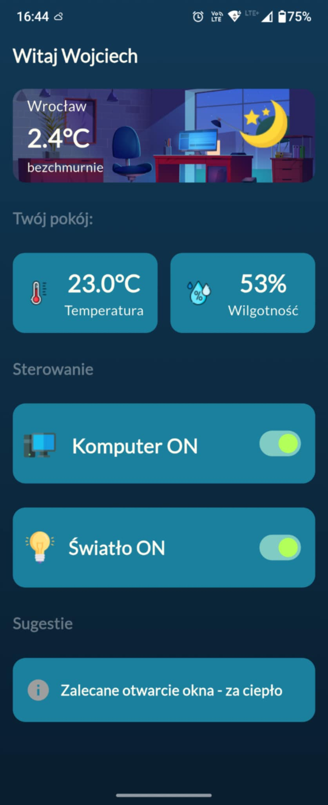

# Destion_esp32_firmawre

## Overview

**ESP32 WiFi Configuration** is the IoT connectivity layer of an intelligent home automation system. Built on the **Espressif ESP32** microcontroller, this module provides WiFi provisioning, cloud integration via Firebase Realtime Database, and intelligent IoT protocol handling.

This project acts as the **cloud bridge** that synchronizes with the [**Destion STM32F411 Control System**](https://github.com/Wojteyk/Destion), creating a complete connected ecosystem for remote monitoring and control.

## Key Features

### WiFi & Connectivity
- **Easy WiFi Provisioning** - Acess point for easy configuration
- **Automatic Reconnection** - Resilient WiFi connection with fallback strategies
- **Power Optimization** - Energy-efficient WiFi modes 
- **UART Bridge** - Serial communication with local Destion controller

### Cloud Integration
- **Firebase Realtime Database** - Real-time data synchronization
- **Server-Sent Events (SSE)** - Persistent stream listening for instant updates
- **Automatic Retry Logic** - Robust cloud connection management
- **Data Persistence** - Secure storage of WiFi credentials via NVS

### Hardware Support
- **Temperature & Humidity Sensor** - SHT40 sensor integration
- **Relay Control** - Smart relay switching for connected devices
- **Window/Door Sensors** - State monitoring for IoT automation
- **UART Terminal** - Debug and manual command interface

### Time Management
- **NTP Time Synchronization** - Automatic internet time sync
- **RTC Synchronization** - Sends accurate time to Destion STM32 via UART
- **Timezone Support** - Proper time zone handling

## App
### Dashboard
#### **Allow to control room from anywhere and read charts from anywhere**

<div style="display: flex; gap: 10px;">
  
  
</div>


## Project Structure

```
esp_wifi_configuration/
├── include/                  # Header files
│   ├── firebase.h           # Firebase cloud integration
│   ├── wifi_provisioning.h  # WiFi setup and management
│   ├── hardware.h           # Hardware abstraction layer
│   ├── uart_connection.h    # UART communication protocol
│   ├── sht40.h              # Temperature/humidity sensor
│   ├── time_sync.h          # NTP and RTC synchronization
│   ├── dns_server.h         # DNS provisioning server
│   └── provisionig_html.h   # WiFi setup web interface
├── src/
│   ├── main.c               # Application entry point
│   ├── firebase.c           # Firebase implementation
│   ├── wifi_provisiong.c    # WiFi provisioning logic
│   ├── hardware.c           # Hardware initialization
│   ├── uart_connection.c    # UART protocol handling
│   ├── sht40.c              # Sensor driver
│   ├── time_sync.c          # Time synchronization
│   └── dns_server.c         # DNS provisioning server
├── CMakeLists.txt           # Build configuration
├── platformio.ini           # PlatformIO settings
├── sdkconfig.esp32dev       # ESP-IDF SDK configuration
├── font.h                   # Font assets
├── huge_app.csv             # Application configuration database
└── .pio/                    # PlatformIO build output
```

## Hardware Specifications

| Component | Details |
|-----------|---------|
| **MCU** | Espressif ESP32 (Dual Xtensa 32-bit, 240 MHz) |
| **Flash** | 4 MB |
| **RAM** | 520 KB (SRAM) |
| **WiFi** | 802.11 b/g/n |
| **Bluetooth** | BLE 5.0 (optional) |
| **Sensors** | SHT40 (I2C) |
| **Communication** | UART, I2C |
| **GPIO Ports** | 34 pins (some input-only) |

## Building and Flashing

### Prerequisites
- **ESP-IDF** v5.0 or later
- **PlatformIO** (recommended) OR Arduino IDE
- **esptool.py** for flashing
- USB to Serial adapter (CH340, FT232, etc.)

### Build Instructions

**Using PlatformIO (Recommended):**
```bash
cd esp_wifi_configuration
pio run --environment esp32dev
```

**Using ESP-IDF:**
```bash
idf.py build
```

**Using Arduino IDE:**
```
Sketch → Export Compiled Binary
```

### Flashing the Device

**Using PlatformIO:**
```bash
pio run --environment esp32dev -t upload
```

**Using esptool.py:**
```bash
esptool.py -p COM3 -b 460800 --chip esp32 write_flash -z 0x1000 \
    .pio/build/esp32dev/firmware.bin
```

**Using Arduino IDE:**
```
Sketch → Upload
```

## Configuration

### WiFi Provisioning
The module supports multiple provisioning methods:

**SoftAP Mode** - WiFi access point for setup


### NTP Server
Default: `pool.ntp.org`  
Configurable for regional servers or private NTP servers

### UART Settings
- **Baud Rate**: 115200
- **Data Bits**: 8
- **Stop Bits**: 1
- **Parity**: None
- **Flow Control**: None

## Integration with Destion STM32F411

The ESP32 module communicates with the Destion microcontroller through UART, forming a complete system:

```
┌─────────────────────────────────────────────────────────────┐
│                      Cloud (Firebase)                       │
│    ┌─────────────────────────────────────────────────────┐  │
│    │  • Real-time database (sensor data, commands)       │  │
│    │  • Authentication & Authorization                   │  │
│    │  • Cloud Functions (optional)                       │  │
│    └─────────────────────────────────────────────────────┘  │
└──────────────────────┬──────────────────────────────────────┘
                       │
      ┌────────────────────────────────┐
      │   ESP32 WiFi Configuration     │
      │  ┌──────────────────────────┐  │
      │  │ • WiFi Management        │  │
      │  │ • Firebase Sync          │  │
      │  │ • Time Sync (NTP)        │  │
      │  │ • Sensor Polling (SHT40) │  │
      │  │ • UART Bridge            │  │
      │  └──────────────────────────┘  │
      └────────┬──────────────────┬────┘
               │ UART             │
      ┌────────▼──────────────────▼────┐
      │  Destion (STM32F411)            │
      │  ┌──────────────────────────┐   │
      │  │ • Local Hardware Control │   │
      │  │ • Display (LCD)          │   │
      │  │ • IR Remote Control      │   │
      │  │ • RTC Management         │   │
      │  │ • Real-time FSM          │   │
      │  └──────────────────────────┘   │
      └─────────────────────────────────┘
```

### Communication Protocol

**UART Message Format:**
```
<COMMAND>:<DATA>\r\n
```

**Command Examples:**

| Command | Direction | Example | Purpose |
|---------|-----------|---------|---------|
| `TIME` | ESP32 → Destion | `TIME:1705600000\r\n` | RTC synchronization |
| `TEMP` | Destion → ESP32 | `TEMP:23.5\r\n` | Send temperature reading |
| `STATE` | Destion → ESP32 | `STATE:ON\r\n` | Device state update |
| `CMD` | ESP32 → Destion | `CMD:RELAY_ON\r\n` | Cloud command execution |
| `SYNC` | Bidirectional | `SYNC:ACK\r\n` | Connection status |

## Key Components

### Firebase Module (`firebase.c`)
- **Stream Listening**: Real-time database path monitoring
- **Data Writing**: PUT requests for sensor updates
- **Automatic Reconnection**: Recovers from connection losses
- **Callback Mechanism**: Event-driven data handling

### WiFi Provisioning (`wifi_provisiong.c`)
- **SoftAP Mode** - WiFi access point for setup
- **SSID/Password Storage**: Encrypted in NVS
- **Auto-Connect**: Automatic connection on startup

### Sensor Integration (`sht40.c`)
- **I2C Communication**: Temperature and humidity polling
- **Data Filtering**: Moving average for stability
- **Periodic Sampling**: Configurable measurement intervals

### Time Synchronization (`time_sync.c`)
- **NTP Protocol**: Network time synchronization
- **Destion RTC Update**: Sends accurate time via UART
- **Timezone Handling**: Local time calculation
- **Leap Second Support**: Proper time handling

### UART Connection (`uart_connection.c`)
- **Line-based Protocol**: Easy parsing and debugging
- **Bidirectional Communication**: Send and receive
- **Buffer Management**: Circular buffers for efficiency
- **Error Handling**: CRC or checksum validation

**Last Updated**: January 2026   
**Supported ESP-IDF Version**: 5.0 and later
